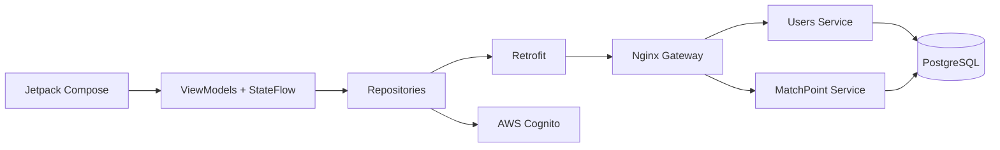
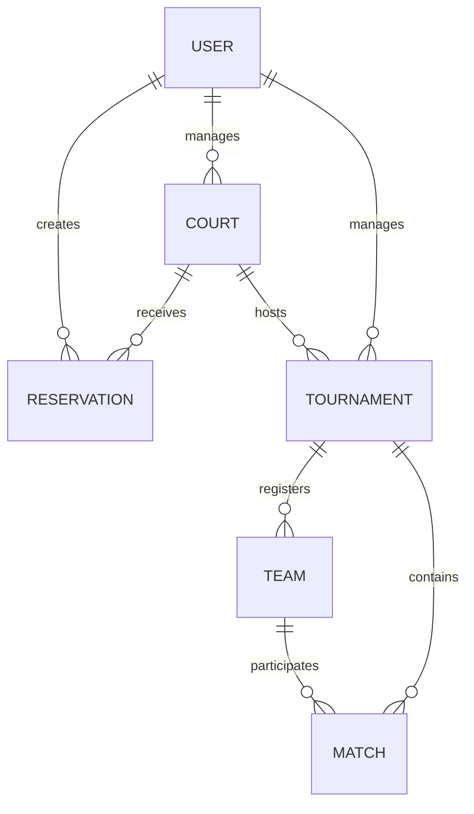

# Arquitectura de MatchPoint

Android usa MVVM por capas: Composables representan estado y emiten eventos; ViewModel coordina; Repository abstrae autenticación/datos; Retrofit contiene contratos HTTP.

El backend aplica `controller → service → repository`, con DTOs en los límites y entidades de persistencia. Controller trata HTTP, service conserva reglas/transacciones y repository es el único acceso a datos. Las excepciones de dominio se traducen globalmente a 400/404/409; Spring Security responde 401/403.

## Dominio

- `User`: identidad de negocio asociada al `sub` de Cognito.
- `Court`: ubicación, superficie, precio, estado y manager propietario.
- `Reservation`: franja de cancha y propietario; no se solapa con otra activa.
- `Tournament`: capacidad potencia de dos, estado y propietario.
- `Team`: inscripción única en un torneo.
- `Match`: posición del cuadro, participantes, programación y resultado.

## Seguridad

1. Android usa `USER_AUTH` con App Client público sin secreto.
2. El token queda en almacenamiento privado de la aplicación.
3. El interceptor envía `Authorization: Bearer` al backend.
4. Backend valida firma, issuer, expiración y client ID del JWT.
5. La autorización comprueba grupo y propiedad del recurso.

La UI por rol no sustituye la autorización del servidor: token inválido produce 401; rol o propietario incorrecto, 403.
