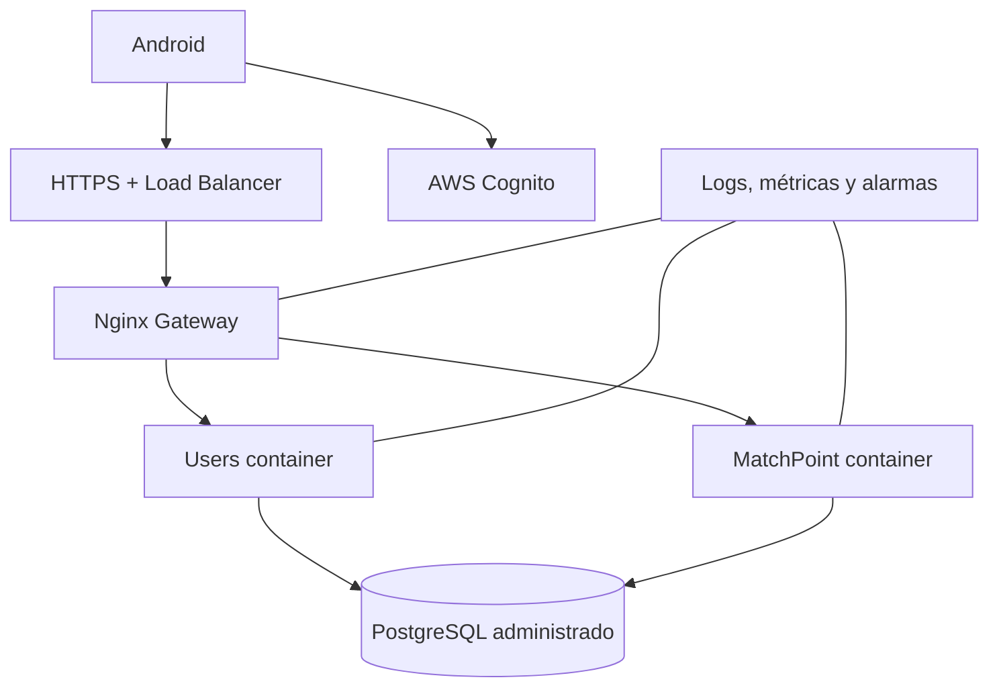

# Infraestructura y computación en la nube

Contenedores inmutables, variables/gestor de secretos, health checks, red privada para servicios/DB, TLS público y backups automáticos.

| Escalamiento | Ventajas | Desventajas | Uso |
|---|---|---|---|
| Vertical | simple, sin coordinación | límite físico y mayor impacto por fallo | PostgreSQL según métricas |
| Horizontal | elasticidad y disponibilidad | exige balanceo/observabilidad/stateless | réplicas de gateway y Spring |

## Aceptación operativa

- `docker compose up -d --build` crea el entorno de desarrollo.
- Health checks retiran instancias no disponibles.
- CPU, memoria, latencia, 5xx y conexiones DB generan alarmas.
- Secretos fuera de imágenes y Git.
- La restauración de backups se ensaya antes de entregar.
