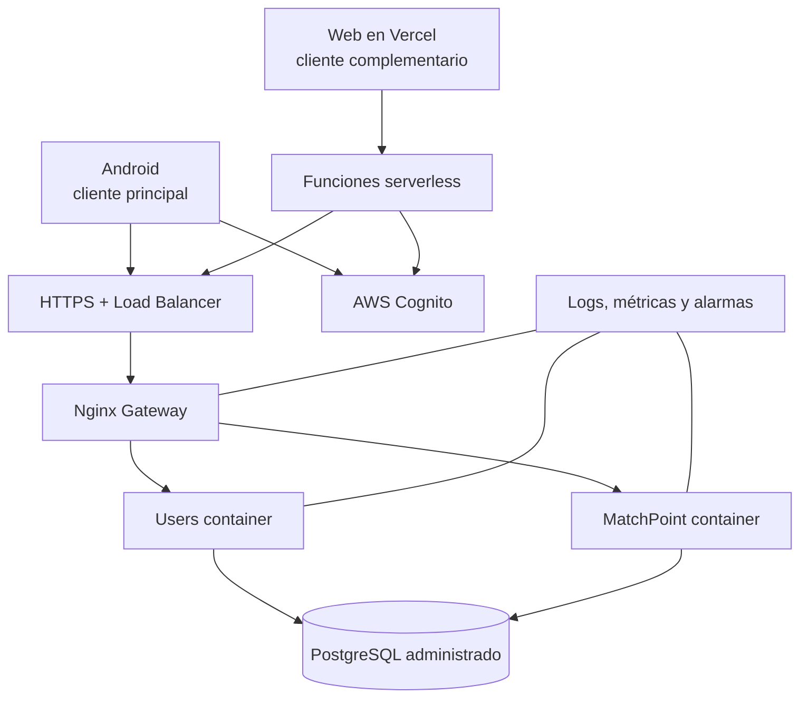

# Infraestructura y computación en la nube

Contenedores inmutables, variables/gestor de secretos, health checks, red privada para servicios/DB, TLS público y backups automáticos.

El cliente Android habla directamente con el gateway. El cliente web no puede hacerlo: Vercel sirve HTTPS y el gateway expone HTTP, de modo que el navegador bloquearía la petición por *mixed content*. Se resuelve con funciones serverless que ejecutan la llamada del lado del servidor y, de paso, mantienen el access token en una cookie `httpOnly` inaccesible para JavaScript.

| Escalamiento | Ventajas | Desventajas | Uso |
|---|---|---|---|
| Vertical | simple, sin coordinación | límite físico y mayor impacto por fallo | PostgreSQL según métricas |
| Horizontal | elasticidad y disponibilidad | exige balanceo/observabilidad/stateless | réplicas de gateway y Spring |

## Capa serverless (Vercel)

| Aspecto | Decisión |
|---|---|
| Modelo | PaaS/serverless: sin servidor que administrar, escalamiento horizontal automático por invocación |
| Escalamiento | Horizontal implícito; complementa el escalamiento del gateway y de los contenedores Spring |
| Configuración | Variables de entorno del proyecto (`API_BASE_URL`, `COGNITO_REGION`, `COGNITO_APP_CLIENT_ID`), nunca en el repositorio |
| Verificación | `GET /api/health` responde si el gateway es alcanzable y si las variables están completas, sin requerir sesión |
| Límite conocido | El gateway se publica por IP pública de EC2; si la instancia se reinicia sin Elastic IP hay que actualizar `API_BASE_URL` |

## Aceptación operativa

- `docker compose up -d --build` crea el entorno de desarrollo.
- Health checks retiran instancias no disponibles.
- CPU, memoria, latencia, 5xx y conexiones DB generan alarmas.
- Secretos fuera de imágenes y Git.
- La restauración de backups se ensaya antes de entregar.
